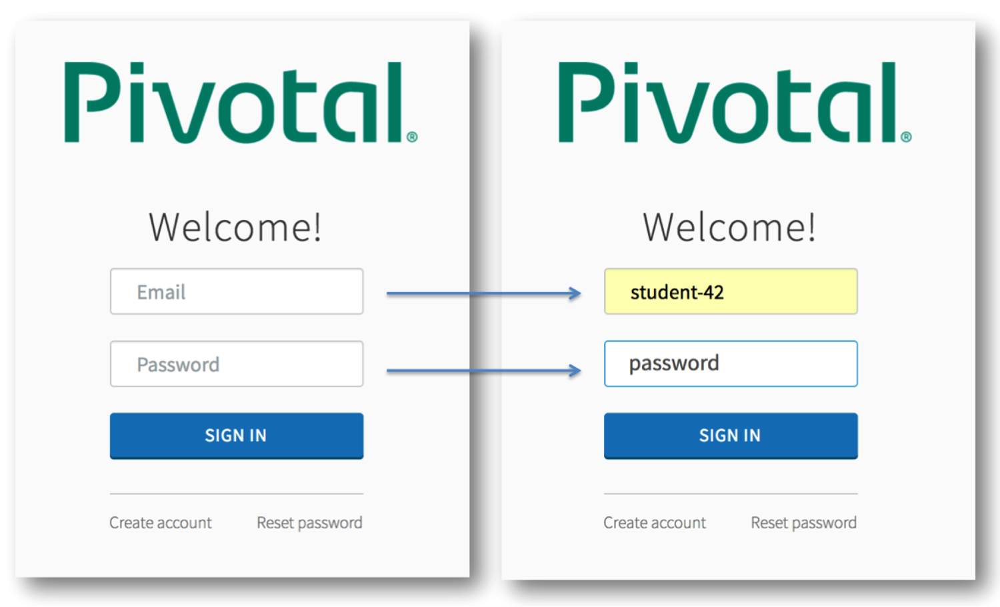
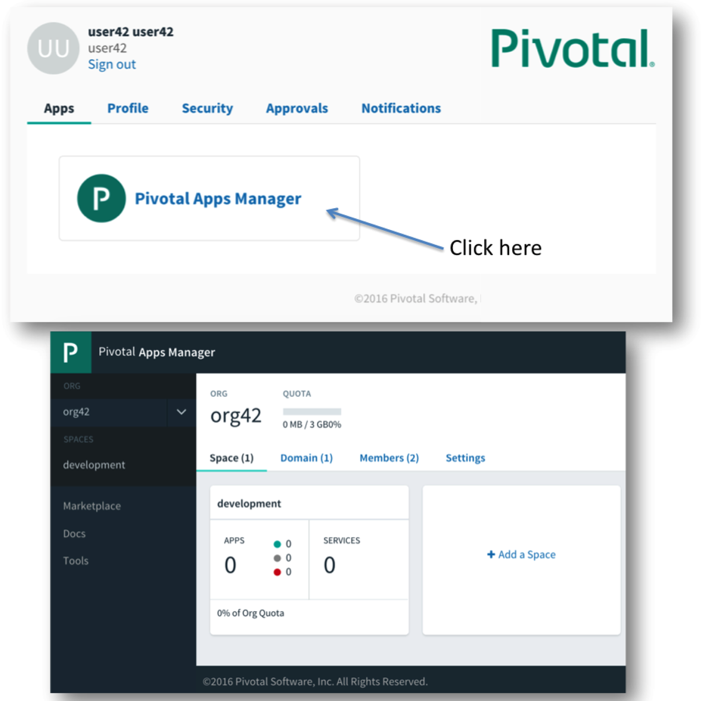

= Lab 0 - Accessing the Workshop Environment

== CF CLI Target and Login

. If you haven't installed the Cloud Foundry CLI yet you can download the latest release of the Cloud Foundry CLI for your operating system from https://console.run.pivotal.io/tools and install it.

. From a command prompt, set the API target for the CLI: (set appropriate end point for your environment)
+
----
> cf api https://api.system.pcf4u.com --skip-ssl-validation
----

. Claim a user_id by entering your e-mail address in the following Google Spreadsheet: http://bit.ly/2lwyflB
. Keep this spreadsheet http://bit.ly/2lwyflB open to record your progress throughout the workshop.

. Login to Pivotal Cloud Foundry (in case of doubt ask an instructor for assistance):

+
----
> cf login
----
+
Follow the prompts, choosing the (user##) username you claimed (the password is password).
+
====
----
> cf login
API endpoint: https://api.system.pcf4u.com

Email> user42

Password> 
Authenticating...
OK

Targeted org org42

Targeted space development

API endpoint:   https://api.system.pcf4u.com (API version: 2.65.0)
User:           user42
Org:            org42
Space:          development

----
====

== AppsManager Login using (preferably) Google Chrome 

. Login to Apps Manager URL: https://apps.system.pcf4u.com. It will redirect you to the login screen. Use the same username and password you entered when using the CF CLI
+
  
  
+

== Congratulations! You have completed Lab0

- [Next: Lab 1 - Pushing Your First Application](session_01/lab_01/lab_01.adoc)
